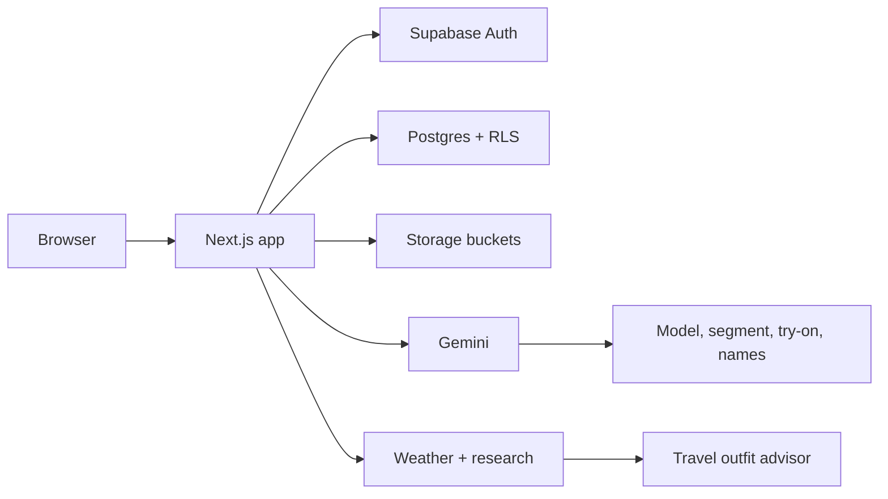

# COCO

**1st Place Winner — [SG TRAE Hackathon 2026](https://luma.com/oj8674lc)**

COCO is an AI virtual wardrobe. Upload a full-body photo, digitize the clothes you already own, and see how outfits look on you before you get dressed. An advisor can also recommend looks from your closet for a city and date, using live weather and local style context.

[](https://luma.com/oj8674lc)
[](https://nextjs.org)
[](https://supabase.com)
[](https://ai.google.dev)
[](LICENSE)

Built at [Build with TRAE @Singapore](https://luma.com/oj8674lc) on 31 January 2026, hosted by the China Singapore AI Association (CSAIA) and presented by [TRAE](https://www.trae.ai).

## Features

- **Digital twin** — Generate a personal model from a full-body photo.
- **Wardrobe digitization** — Photograph garments; Gemini segments, names, and categorizes them.
- **Virtual try-on** — Mix pieces and render the outfit on your model.
- **Saved looks** — Favorite try-ons and keep them organized.
- **Community feed** — Share outfits, tag items, and browse what friends are wearing.
- **Friends** — Search people, send requests, and keep a private circle.
- **Travel style advisor** — Ask for a destination and date. COCO pulls weather, local clothing context, and a suggested outfit from your own wardrobe.

## Tech stack

| Layer | Choice |
| --- | --- |
| App | Next.js 16, React 19, Tailwind CSS 4 |
| Auth, database, storage | Supabase (Postgres, RLS, Storage) |
| Image and language models | Google Gemini |
| Travel / weather research | Tavily (optional) |
| UI | Radix UI, Framer Motion, Lucide |



## Project structure

```text
.
├── nextjs/                 Next.js app
│   ├── src/app/            Landing, auth, and product routes
│   ├── src/app/api/        Gemini, wardrobe, and advisor APIs
│   ├── src/components/     UI, layout, and chatbot
│   └── src/lib/            Supabase, Gemini, and advisor services
└── supabase/               Schema and policy scripts
```

## Getting started

### Prerequisites

- Node.js 20+
- A [Supabase](https://supabase.com) project
- A [Google Gemini](https://ai.google.dev) API key
- A [Tavily](https://tavily.com) API key if you want live weather and research in the advisor

### 1. Install

```bash
git clone https://github.com/jovantan88/TRAE-Hackathon-2026-Winner.git
cd TRAE-Hackathon-2026/nextjs
npm install
```

### 2. Environment

```bash
cp .env.example .env.local
```

Fill in:

| Variable | Purpose |
| --- | --- |
| `NEXT_PUBLIC_SUPABASE_URL` | Supabase project URL |
| `NEXT_PUBLIC_SUPABASE_ANON_KEY` | Supabase anon / public key |
| `GEMINI_API_KEY` | Server-side Gemini key |
| `TAVILY_API_KEY` | Optional. Used by the travel advisor |

If your Supabase project uses a different hostname than the default in `next.config.ts`, add it to `images.remotePatterns`.

### 3. Database

In the Supabase SQL Editor, run the scripts in [`supabase/`](supabase/README.md) in order. That creates profiles, wardrobe and try-on tables, social features, the advisor tables, storage buckets, and the visibility policies the feed depends on.

### 4. Run

```bash
npm run dev
```

Open [http://localhost:3000](http://localhost:3000).

## Event

COCO took **first place** at **SG TRAE Hackathon 2026** — [Build with TRAE @Singapore](https://luma.com/oj8674lc).

The event brought Singapore builders together to ship full-stack products with TRAE, with judging on the same day. First place included SGD 500 and a Google Singapore office tour.

## License

MIT. See [LICENSE](LICENSE).
